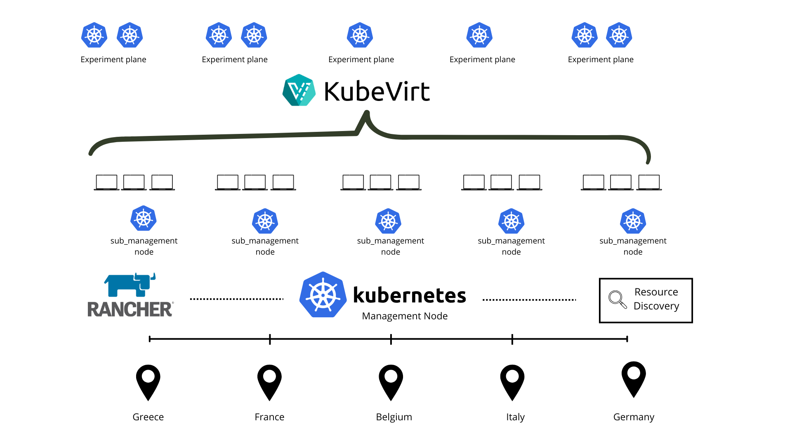

# Edge Cluster Provisioner

## Overview

The Cluster Provisioner is a Python-based automation framework developed to manage multi-site Kubernetes clusters using **Rancher**, **KubeVirt**, and **CDI** technologies. It provides an integrated solution for the full lifecycle of **edge/cloud-native clusters**, automating provisioning, configuration, network customization, and virtual machine deployment across distributed environments.

⚠️ Beta Version Notice: This system is currently in beta and has been successfully tested across distributed nodes in Greece and France. Additional engineering efforts are required to evolve it into a production-ready commercial-grade solution.



## Key Features

* **Full Cluster Lifecycle**: Creation, registration, monitoring, and deletion of Rancher-managed Kubernetes clusters.
* **VM-based Cluster Nodes**: Uses KubeVirt to create VMIs as master and worker nodes.
* **CDI Integration**: Automates importing QCOW2/ISO images via DataVolumes.
* **Network Support**: Supports Multus/bridge networking with static IP configuration.
* **Custom CIDR Allocation**: Avoids IP conflicts across clusters with dynamic CIDR planning.
* **Admin Operations**: Automates Kubeconfig extraction and node registration.
* **Multi-location Support**: Centralized management node (Rancher) controls sub-management nodes in different countries.

---

## Dependencies

* Python 3.8+
* Kubernetes Python Client
* KubeVirt + CDI
* Rancher (>=v2.6)

Install dependencies:

On the next versions we will provide Ansible scripts to auto-install the dependencies on each site/node.

---

## Architecture

The architecture supports multiple **sub-management nodes** (e.g. in Greece, France, Belgium, Italy, Germany) connected to a centralized Rancher **Management Node**. Each sub-node manages **experiment planes** consisting of VMs provisioned via KubeVirt.


## Future Enhancements

* **Web UI for visual management**

* **Interconnectivity between experimental VMs from different management clusters/nodes**

* **Intent-based experimentation.**

---

## Example Usage

```python
from cluster_provisioner import create_kubevirt_cluster

cluster_name = "final-test"
namespace = "testing-k3s"
cluster_type = "k3s"
kubernetes_version = "v1.31.5+k3s1"
cni = "flannel"

vm_definitions = [
    {
        "vmi_name": "cluster-master",
        "disk_size": 15,
        "disk_image": "https://cloud-images.ubuntu.com/focal/current/focal-server-cloudimg-amd64.img",
        "cpu_cores": 6,
        "ram": "4096M",
        "multus_interfaces": [...],
        "roles": ["control plane", "worker"]
    },
    {
        "vmi_name": "worker1",
        "disk_size": 15,
        "disk_image": "https://cloud-images.ubuntu.com/focal/current/focal-server-cloudimg-amd64.img",
        "cpu_cores": 6,
        "ram": "4096M",
        "multus_interfaces": [...],
        "roles": ["worker"]
    }
]

config = create_kubevirt_cluster(
    cluster_name=cluster_name,
    namespace=namespace,
    cluster_type=cluster_type,
    kubernetes_version=kubernetes_version,
    cni=cni,
    vm_definitions=vm_definitions
)
```


## Contact

**Author**: Theodoros Tsourdinis
**Email**: [theodoros.tsourdinis@sorbonne-universite.fr](mailto:theodoros.tsourdinis@sorbonne-universite.fr)

For more details, refer to the [source code](#) and contribute!
